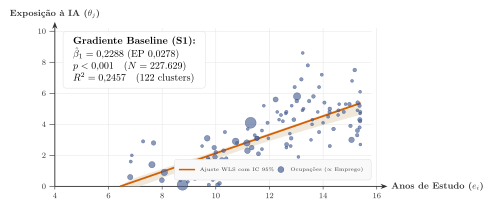
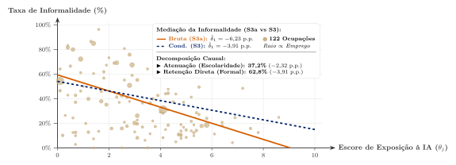
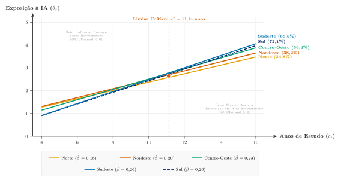
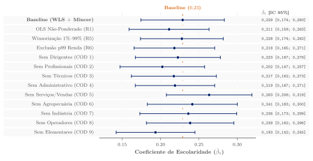

## Motivação: A Dualidade do Mercado de Trabalho Brasileiro

:::: {.columns}
::: {.column width="56%"}
**O debate global sobre IA:**

- Foco em economias avançadas com alta formalidade e predomínio de serviços corporativos [@eloundou2024gpts].
- Premissa implícita: difusão tecnológica homogênea.

**A realidade estrutural do Brasil (PNAD Contínua 2026Q1):**

- [**39,2% de informalidade**]{.emorygold} na força de trabalho ocupada.
- [**35,7 milhões de trabalhadores (35,0%)**]{.emorygold} em ocupações de baixíssima exposição à IA (quintil inferior).
- Forte heterogeneidade regional: formalidade varia de 40% (MA/PA) a 65% (SP/SC).
:::

::: {.column width="38%"}
::: {.keybox}
**Questão Central**

Como a coexistência entre [**informalidade**]{.emorygold} e [**capital humano**]{.emorygold} molda a exposição à IA em uma economia em desenvolvimento?
:::

**Mecanismo Proposto:**  
A IA é complementar ao capital humano formal, mas a informalidade atua como barreira de absorção tecnológica.
:::
::::

## Três Perguntas de Pesquisa

1. **Gradiente Educacional:**
   - Trabalhadores mais escolarizados selecionam-se em postos de trabalho mais expostos à IA?
   - Esse gradiente resiste ao controle de rendimento e covariáveis mincerianas?

2. **O Canal da Informalidade (Mediação):**
   - A baixa exposição informal é apenas reflexo de menor escolaridade, ou existe um efeito direto do [**capital organizacional formal**]{.emorygold}?

3. **Polarização Espacial & Heterogeneidade Regional:**
   - Mercados regionais com maior profundidade formal ampliam ou reduzem a distância de exposição entre trabalhadores qualificados e não qualificados?

# Modelo Teórico de Alocação e Arbitragem

## Modelo de Designação Ocupacional (Assignment Model)

:::: {.columns}
::: {.column width="48%"}
**Trabalhadores e Ocupações:**

- Escolaridade contínua: $e \in [e_{\min}, e_{\max}]$.
- Ocupações com exposição à IA: $\theta_j \in [0, 10]$.
- Regimes contratuais: $s \in \{F, I\}$ (Formal vs. Informal).

**Função de Produção Primitiva:**

$$y_{js}(e) = g(e)\big(1 + \kappa_s \theta_j\big)$$

com $g'(e) > 0, g''(e) \le 0$ e $\Delta\kappa \equiv \kappa_F - \kappa_I > 0$ ($\kappa_F \equiv \kappa_{\text{org}} > \kappa_I \equiv \kappa_{\text{ind}}$).
:::

::: {.column width="48%"}
::: {.methodbox}
**Supermodularidade Estrita**

$$\frac{\partial^2 y}{\partial e \partial \theta} = g'(e)\,\kappa_s > 0$$

A IA complementa o capital humano do trabalhador.
:::

**Estrutura de Custos Institucionais:**

- Formalização impõe custo fixo $c > 0$ por trabalhador [@ulyssea2018firms].
- $w_{jF}(e) = y_{jF}(e) - c$ e $w_{jI}(e) = y_{jI}(e)$.
:::
::::

## Arbitragem Formal-Informal e Previsões Teóricas

:::: {.columns}
::: {.column width="48%"}
**Limiar de Formalização Ocupacional:**

$$w_{jF}(e) \ge w_{jI}(e) \iff g(e)\,\Delta\kappa\,\theta_j \ge c$$

. . .

$$
\boxed{e^*_j = g^{-1}\left(\frac{c}{\Delta\kappa\,\theta_j}\right)}
\quad \implies \frac{\partial e^*_j}{\partial \theta_j} < 0
$$

- Maior $\theta_j$ reduz a escolaridade mínima: ganhos produtivos ($\Delta\kappa \theta_j$) amortizam o custo fixo $c$.
:::

::: {.column width="48%"}
::: {.keybox}
**Proposição 1 (Gradiente Positivo)**

Por supermodularidade estrita [@topkis1998supermodularity], a alocação de equilíbrio $\theta^*(e)$ é crescente em $e$ ($\theta^{*\prime}(e) > 0$).
:::

**Corolário 1 (Mediação Parcial):**  
A associação bruta exposição--formalidade atenua-se ao condicionar na escolaridade, mas retém coeficiente direto significativo ($\Delta\kappa > 0$).
:::
::::

# Dados Microeconômicos e Estratégia Empírica

## Microdados da PNAD Contínua e Construção do Escore $\theta_j$

:::: {.columns}
::: {.column width="52%"}
**Base Amostral:**

- **IBGE PNAD Contínua 2026Q1**: $N = 227.629$ indivíduos ocupados, representativos de 102,1 milhões de trabalhadores.
- Pesos amostrais complexos (`weight` / `V1028`) aplicados em todas as estimações (WLS).

**Harmonização Internacional do Escore $\theta_j$:**

- Medida O*NET-SOC (0--10) [@eloundou2024gpts].
- Crosswalk: $\text{O*NET} \to \text{ISCO-08} \to \text{COD (IBGE)}$.
- $G = 122$ grupos ocupacionais a 4 dígitos.
:::

::: {.column width="44%"}
::: {.methodbox}
**Correção de Moulton (1986)**

Erros-padrão agrupados por [**122 clusters ocupacionais**]{.emorygold} [@cameron2008bootstrap].
:::

**Estratégia de Controle Minceriano:**

Idade, idade$^2$, dummy de gênero feminino e vetor de dummies de cor/raça (IBGE).
:::
::::

## Especificações Econométricas Estimadas

:::: {.columns}
::: {.column width="48%"}
**Modelos no Nível Individual:**

- **S1 (Gradiente Baseline):**
  $$\theta_{j(i)} = \alpha + \beta_1 \, e_i + \mathbf{X}_i'\boldsymbol{\gamma} + \varepsilon_i$$

- **S2 (Controle de Rendimento):**
  $$\theta_{j(i)} = \alpha + \beta_1 \, e_i + \beta_w \, w_i + \mathbf{X}_i'\boldsymbol{\gamma} + \varepsilon_i$$
:::

::: {.column width="48%"}
**Mecanismos e Espaço:**

- **S3 (Mediação / Seleção na Informalidade):**
  $$\begin{aligned}
    \text{informal}_i &= \alpha + \delta_1 \, \theta_{j(i)} \\
    &+ \delta_2 \, e_i + \mathbf{X}_i'\boldsymbol{\gamma} + \varepsilon_i
  \end{aligned}$$

- **S4 (Interação Regional LOO):**
  $$\begin{aligned}
    \theta_{j(i)} = \alpha &+ \beta_1 \, e_i + \beta_2 \big(e_i \times \text{formal}_{-i, u}^{\text{LOO}}\big) \\
    &+ \beta_3 \, \text{formal}_{-i, u}^{\text{LOO}} + \mathbf{X}_i'\boldsymbol{\gamma} + \varepsilon_i
  \end{aligned}$$
:::
::::

# Resultados Empíricos e Mecanismos

## Resultado 1: Gradiente Escolaridade--Exposição ($\hat{\beta}_1 = 0{,}23$)

:::: {.columns}
::: {.column width="50%"}
**Estimação no Nível Individual ($N = 227.629$):**

- **S1 Baseline:** $\hat{\beta}_1 = \mathbf{0{,}2288} \approx \mathbf{0{,}23}$ (EP $0{,}028; p < 0{,}001; R^2 = 0{,}246$).
- Cada 4 anos de estudo elevam a exposição em $\sim 1$ ponto no escore 0--10.
- **S2 Salário:** $\hat{\beta}_1 = \mathbf{0{,}21}$ (EP $0{,}026$); Rendimento: $\hat{\beta}_w = \mathbf{0{,}043}$ ($p < 0{,}001$).

::: {.keybox}
**Limites de Oster (2019)**

$\delta = \mathbf{1{,}64} > 1$ sob $R_{\max} = 1{,}3 R^2$: seleção em não observáveis precisaria ser 64% superior aos controles para anular $\hat{\beta}_1$.
:::
:::

::: {.column width="46%"}
{fig-align="center" width="100%"}
:::
::::

## Resultado 2: Mediação Parcial da Informalidade (Corolário 1)

:::: {.columns}
::: {.column width="50%"}
**Decomposição Linear Exata:**

- **S3a (Bruta):** $\hat{\delta}_1 = \mathbf{-6{,}23}$ p.p. por ponto de $\theta_j$ (EP $0{,}99; p < 0{,}001$).
- **S3 (Condicional):** $\hat{\delta}_1 = \mathbf{-3{,}91}$ p.p. (EP $0{,}96$) e $\hat{\delta}_2 = \mathbf{-2{,}61}$ p.p. por ano de estudo.

. . .

::: {.resultbox}
**Decomposição de Canais: $\frac{-3{,}91}{-6{,}23} = \mathbf{62{,}8\%}$**

- [**37,2% Atenuação**]{.emorygold}: Seleção educacional em tarefas cognitivas.
- [**62,8% Efeito Direto**]{.emorygold}: Governança, escala de dados e capital organizacional ($\Delta\kappa > 0$).
:::
:::

::: {.column width="46%"}
{fig-align="center" width="100%"}
:::
::::

## Resultado 3: Polarização Espacial e Formalidade Regional (S4)

:::: {.columns}
::: {.column width="50%"}
**Estimativas da Interação Regional (S4):**

- Interação $\text{Esc} \times \text{Formal}$: $\hat{\beta}_2 = \mathbf{+0{,}28}$ (EP $0{,}06; p < 0{,}001$).
- Efeito Principal Formalidade: $\hat{\beta}_3 = \mathbf{-3{,}10}$ (EP $0{,}77; p < 0{,}001$).

**Derivada Marginal Total:** $\frac{\partial \theta}{\partial \text{formal}_u} = -3{,}10 + 0{,}28 \, e_i$

. . .

::: {.keybox}
**Limiar Crítico de Polarização: $e^* = 11{,}14$ anos**

- $e_i = 8$ anos (Fund.): $\frac{\partial \theta}{\partial \text{formal}_u} = \mathbf{-0{,}86}$ ponto (segregação manual).
- $e_i = 16$ anos (Sup.): $\frac{\partial \theta}{\partial \text{formal}_u} = \mathbf{+1{,}38}$ ponto (complementaridade).
:::
:::

::: {.column width="46%"}
{fig-align="center" width="100%"}
:::
::::

## Bateria de Robustez Econométrica (R1--R7)

:::: {.columns}
::: {.column width="50%"}
**Sensibilidade e Especificação:**

- **Amostra e Outliers:** Winsorização 1%/99% ($\hat{\beta}_1 = 0{,}23$); Exclusão p99 ($\hat{\beta}_1 = 0{,}22$); Exclusão dos 9 grupos COD ($\hat{\beta}_1 \in [0{,}19; 0{,}26]$).
- **Forma Funcional (R4):** $\log(1+\theta)$ ($\hat{\beta}_1 = 0{,}07; p < 0{,}001$).
- **Pesos Amostrais (R1):** OLS não-ponderado ($\hat{\beta}_1 = 0{,}21$).

::: {.methodbox}
**Wild Cluster Bootstrap (27 UFs)**

$p < 0{,}001$ com 1.000 replicações para a interação regional.
:::
:::

::: {.column width="46%"}
{fig-align="center" width="100%"}
:::
::::

## Conclusões e Implicações de Política Pública

:::: {.columns}
::: {.column width="48%"}
**Principais Achados:**

1. **Gradiente Positivo:** A IA complementa postos de trabalho de alta qualificação no Brasil ($\hat{\beta}_1 = 0{,}23$).
2. **Canal Organizacional:** A informalidade atua como barreira de absorção tecnológica (62,8% do diferencial retido).
3. **Polarização Geográfica:** A formalização regional aprofunda o hiato de exposição ($e^* \approx 11$ anos).
:::

::: {.column width="48%"}
::: {.highlightbox}
**Recomendações de Política**

- **Qualificação Digital na Base:** Evitar a exclusão permanente dos 35,7 milhões de trabalhadores em ocupações informais de baixa exposição.
- **Incentivos à Formalização Tecnológica:** Políticas de transição formal com ênfase em infraestrutura corporativa digital (PMEs).
:::
:::
::::

## Referências Selecionadas

::: {#refs}
:::
