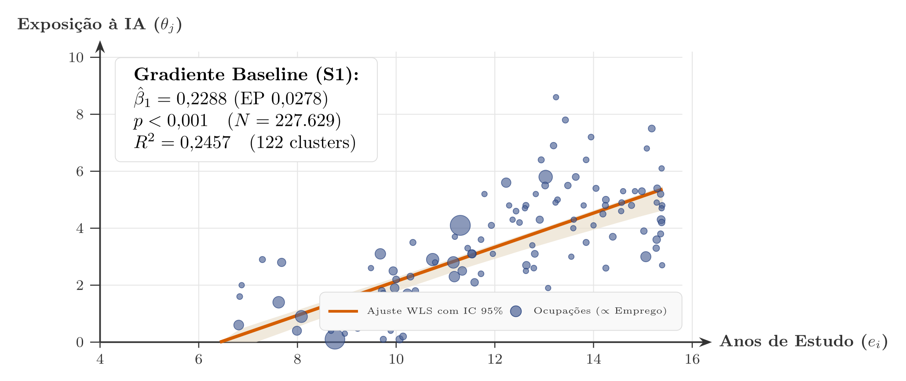
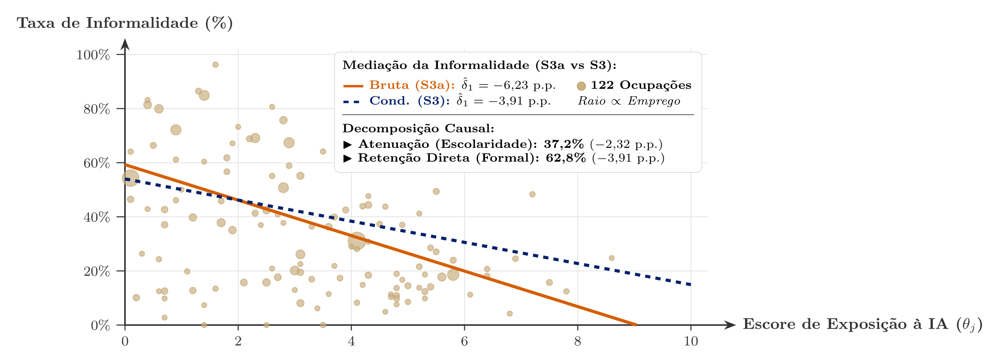
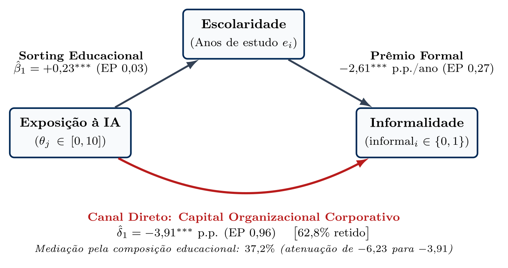
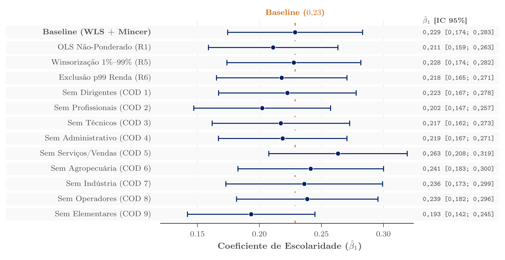
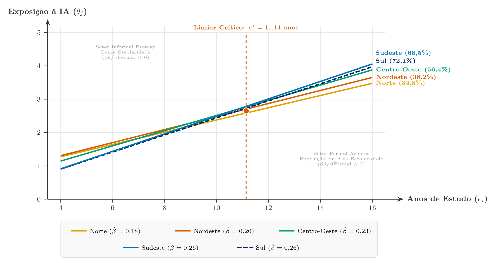

# Visão Geral

## Row

::: {.valuebox icon="people" color="primary"}
Trabalhadores Analisados

227.629

PNAD Contínua 2026Q1
:::

::: {.valuebox icon="briefcase" color="info"}
Grupamentos Ocupacionais

122

Grupos a 3 dígitos (COD-IBGE)
:::

::: {.valuebox icon="graph-up-arrow" color="primary"}
Gradiente Educacional

β = +0,23***

p < 0,001 (EP: 0,028)
:::

::: {.valuebox icon="shield-check" color="success"}
Barreira da Informalidade

62,8% Direto

Efeito do canal de governança
:::

## Row

### Column {width=55%}

::: {.card title="Resumo da Pesquisa & Contexto"}
#### Exposição à Inteligência Artificial em um Mercado de Trabalho Informal: Teoria e Evidências para o Brasil

Em que medida o mercado de trabalho brasileiro está efetivamente exposto à inteligência artificial e quem são os trabalhadores expostos? Este estudo desenvolve um **modelo de designação de tarefas (task assignment model)** com adoção individual e corporativa de IA sob informalidade contratual, testando suas previsões sobre **227.629 microdados** da PNAD Contínua (IBGE, 2026Q1) vinculados deterministicamente ao índice de exposição ocupacional de Eloundou et al. (2024).

::: {.callout-tip title="Principais Conclusões Empíricas"}
- **Gradiente Educacional:** Cada ano adicional de escolaridade está associado a **+0,23 ponto** de exposição à IA ($EP = 0{,}028, p < 0{,}001$) em modelos WLS com controles mincerianos completos.
- **Barreira da Informalidade:** A associação negativa bruta (−6,23 p.p.) atenua-se em **37,2%** após o controle por educação, preservando um **efeito organizacional direto de 62,8%**.
- **Heterogeneidade Espacial:** O gradiente educacional intensifica-se com a maturidade do setor formal estadual (interação = 0,28***), operando um limiar de reversão em **e* = 11,14 anos**.
- **Escala de Isolamento:** 35% da força de trabalho ocupada (35,7 milhões de trabalhadores) atua em ocupações com exposição quase nula à IA ($\theta \le 2$).
:::

**Autor:** Marcelo Moura Freire (Universidade de Coimbra)  
**Códigos JEL:** J23, J24, O33, O17, J46
:::

### Column {width=45%}

::: {.card title="Gradiente Educacional de Exposição à IA (Figura 1)"}


*Figura 1: Escore médio de exposição à IA (0–10) por anos de estudo concluídos com intervalos de confiança de 95%. Tamanho dos círculos proporcional ao total de ocupados. Fonte: PNAD Contínua 2026Q1 (N = 227.629).*
:::

## Row

::: {.valuebox icon="cpu" color="light"}
Exposição Média à IA

2,86

DP: 1,85 · Amplitude: 0,1–8,6
:::

::: {.valuebox icon="mortarboard" color="light"}
Escolaridade Média

11,59 anos

DP: 3,81 · Anos de estudo concluídos
:::

::: {.valuebox icon="file-earmark-x" color="light"}
Taxa de Informalidade

40,5%

38,8% na amostra não ponderada
:::

::: {.valuebox icon="cash-stack" color="light"}
Rendimento Médio Mensal

R$ 3.556

DP: R$ 5.443 · Habitual
:::

::: {.valuebox icon="geo-alt" color="light"}
Abrangência Geográfica

27 UFs

Todas as Unidades da Federação
:::


# Ocupações

## Row

### Column {width=50%}

::: {.card title="Decomposição da Mediação pela Informalidade (Figura 2)"}


*Figura 2: Associação bruta (S3a: −6,23 p.p., linha contínua vermelha) vs. efeito direto de governança condicional (S3: −3,91 p.p., linha tracejada azul). Tamanho das bolhas proporcional ao emprego ocupacional.*
:::

### Column {width=50%}

::: {.card title="Modelo Teórico: Canais Duais de Adoção de IA"}
::: {.callout-note title="Modelo de Designação Ocupacional com Informalidade"}
Em uma economia caracterizada pela informalidade contratual, a adoção de IA se bifurca em dois canais distintos:

1. **Complementaridade Cognitiva Individual:** Trabalhadores por conta própria e informais adotam ferramentas genéricas de consumo (ex.: ChatGPT, Copilot) diretamente em dispositivos móveis para elevar sua produtividade pessoal.
2. **Integração Corporativa/Empresarial:** Firmas formais investem em fluxos proprietários de IA, APIs empresariais e reestruturação organizacional de processos. Isso requer segurança jurídica, responsabilidade corporativa, capital gerencial e infraestrutura digital complementar.
:::

::: {.callout-important title="A Informalidade como Amortecedor Tecnológico"}
Como **40,5% dos trabalhadores brasileiros são informais**, a ausência de capital organizacional corporativo funciona como amortecedor para ocupações de menor escolaridade contra choques imediatos de automação. **35,7 milhões de trabalhadores (35%)** ocupam postos com exposição quase nula ($\theta \le 2$), predominantemente na agricultura de subsistência, serviços domésticos informais e cuidados pessoais.
:::
:::

## Row

::: {.card title="Distribuição da Exposição Ocupacional por Grandes Grupos (PNAD Contínua 2026Q1)"}
::: {.table-responsive}
| Grande Grupo Ocupacional | Força de Trabalho (Milhões) | Exposição Média (θ) | Taxa de Informalidade (%) | Escolaridade Média (anos) | Rendimento Médio Mensal |
|:-------------------------|----------------------------:|--------------------:|--------------------------:|--------------------------:|------------------------:|
| **Apoio Administrativo** | 8,9M | 5,4 | 16,1% | 13,1 anos | R$ 2.949 |
| **Diretores e Gerentes** | 3,6M | 4,8 | 15,4% | 14,2 anos | R$ 9.732 |
| **Profissionais das Ciências e Intelectuais** | 14,0M | 4,4 | 27,8% | 15,6 anos | R$ 7.160 |
| **Técnicos e Profissionais de Nível Médio** | 9,2M | 4,4 | 26,6% | 13,6 anos | R$ 4.620 |
| **Trabalhadores dos Serviços e Comércio** | 22,4M | 2,9 | 41,6% | 11,4 anos | R$ 2.572 |
| **Operadores de Instalações e Máquinas** | 9,6M | 2,2 | 39,8% | 10,4 anos | R$ 2.828 |
| **Trabalhadores Agropecuários** | 4,9M | 1,9 | 82,4% | 7,8 anos | R$ 2.327 |
| **Trabalhadores da Produção e Artesãos** | 13,2M | 1,5 | 50,4% | 9,9 anos | R$ 2.680 |
| **Ocupações Elementares** | 15,8M | 0,6 | 57,0% | 8,9 anos | R$ 1.609 |
| **Total / Economia Nacional** | **101,6M** | **2,86** | **40,5%** | **11,59 anos** | **R$ 3.556** |
:::

*Nota: Microdados agregados da PNAD Contínua 2026Q1 vinculados deterministicamente aos escores de exposição de Eloundou et al. (2024).*
:::


# Econometria

## Row

### Column {.tabset width=60%}

::: {.card title="Modelos S1 & S2: Gradiente Educacional"}
| Regressor | (1) Linha de Base S1 | (2) + Rendimento S2 |
|:----------|---------------------:|--------------------:|
| **Anos de estudo (escolaridade)** | **0,2288\*\*\*** (0,0278) | **0,2097\*\*\*** (0,0260) |
| **Rendimento habitual (R$ mil)** | — | **0,0427\*\*\*** (0,0100) |
| **Mulher** | 0,0509 (0,3096) | 0,1132 (0,3002) |
| **Idade** | -0,0399* (0,0235) | -0,0473\*\* (0,0234) |
| **Idade² / 1.000** | 0,4900\*\* (0,2257) | 0,5425\*\* (0,2245) |
| Controles Demográficos e de Raça | Sim | Sim |
| **Observações (N)** | **227.629** | **227.629** |
| **R²** | **0,2457** | **0,2595** |
| **Clusters (Ocupações COD)** | **122** | **122** |

::: {.callout-note}
Erros-padrão clusterizados no nível de ocupação (122 clusters COD) entre parênteses. * p < 0,1; ** p < 0,05; *** p < 0,001.
:::
:::

::: {.card title="Modelo S3: Informalidade & Mediação"}
| Regressor | (S3a) Incondicional | (S3) Condicional (+ Escolaridade) |
|:----------|--------------------:|-----------------------------------:|
| **Exposição à IA (θ, 0–10)** | **-6,2285\*\*\*** (0,9871) | **-3,9068\*\*\*** (0,9565) |
| **Anos de estudo (escolaridade)** | — | **-2,6089\*\*\*** (0,2697) |
| Controles Mincerianos e de Raça | Sim | Sim |
| **Observações (N)** | **227.629** | **227.629** |
| **R²** | **0,0800** | **0,1082** |
| **Clusters (Ocupações COD)** | **122** | **122** |

::: {.callout-tip title="Decomposição da Mediação"}
- **Efeito bruto (S3a):** −6,23 p.p. de informalidade por ponto de exposição.
- **Atenuação pela escolaridade:** 37,2% da associação bruta opera pela seleção em capital humano.
- **Efeito organizacional direto (S3):** 62,8% (−3,91 p.p.) persiste como barreira de formalização em nível de firma.
:::
:::

::: {.card title="Diagrama Causal de Mediação (DAG)"}


::: {.callout-note title="Decomposição Estrutural dos Canais"}
A análise econométrica decompõe a relação negativa entre exposição à IA e informalidade ($-6{,}23$ p.p., Modelo S3a):

- **Canal Indireto (Composição Educacional, $37{,}2\%$):** Ocupações com maior exposição selecionam trabalhadores mais escolarizados ($\hat{\beta}_1 = +0{,}23^{***}$), reduzindo a informalidade em $-2{,}61^{***}$ p.p./ano.
- **Canal Direto (Capital Organizacional Corporativo, $62{,}8\%$):** O efeito residual direto ($\hat{\delta}_1 = -3{,}91^{***}$ p.p., Modelo S3) capta a exigência de governança, infraestrutura de dados e escala de firmas formais.
:::
:::

::: {.card title="Modelo S4: Heterogeneidade Espacial"}
| Regressor | (S4) Interação Regional |
|:----------|------------------------:|
| **Anos de estudo (escolaridade)** | **0,0681\*\*** (0,0326) |
| **Escolaridade × Profundidade da Formalidade Estadual (LOO)** | **0,2786\*\*\*** (0,0649) |
| **Taxa de Formalidade Estadual (leave-one-out)** | **-3,1042\*\*\*** (0,7671) |
| Controles Demográficos e de Raça | Sim |
| **Observações (N)** | **227.629** (122 clusters) |
| **R²** | **0,2499** |

::: {.callout-important title="Limiar de Reversão"}
$\partial \theta / \partial \text{formal}_u = -3{,}1042 + 0{,}2786 \times \text{escolaridade}$.  
**Limiar de inflexão:** $e^* = 3{,}1042 / 0{,}2786 = \mathbf{11{,}14\text{ anos}}$ (conclusão exata do ensino médio).
:::
:::

### Column {width=40%}

::: {.card title="Limites de Seleção de Oster (2019)"}
| Parâmetro | $R_{\max} = 1{,}0$ (Conservador) | $R_{\max} = 1{,}3 \times R^2$ (Recomendado) |
|:----------|--------------------------------:|--------------------------------------------:|
| **$\beta$ (Não controlado)** | 0,2288 | 0,2288 |
| **$\beta$ (Controlado)** | 0,2097 | 0,2097 |
| **$R^2$ (Controlado)** | 0,2595 | 0,2595 |
| **$\delta$ para $\beta^* = 0$** | 0,20 | **1,64** |
| **$\beta^*(\delta = 1)$** | -0,8449 | **+0,0816** |

::: {.callout-tip title="Interpretação Econométrica"}
Sob a diretriz padrão da AEA de $R_{\max} = 1{,}3 \times R^2$, o parâmetro de estabilidade de Oster é **$\delta = 1,64 > 1$**.

Confundidores não observados precisariam ser **64% mais importantes** do que todos os controles observáveis demográficos, de capital humano e de rendimento combinados para anular o gradiente educacional positivo.
:::
:::

## Row

### Column {width=60%}

::: {.card title="Bateria de Sensibilidade: Forest Plot (Figura 5)"}


*Figura 5: Estimativas de β₁ em 13 especificações alternativas: WLS linha de base (0,2288), MQO não ponderado (0,2111), Winsorização 1%/99% da exposição (0,2278), Exclusão do 1% de maior renda (0,2266) e testes de exclusão iterativa (leave-one-out) dos grandes grupos COD.*
:::

### Column {width=40%}

::: {.card title="Resumo de Robustez & Bateria de Estabilidade"}
::: {.callout-note title="Testes de Especificação Aprovados"}
1. **Ponderação Amostral (R1):** O MQO não ponderado produz $\hat{\beta}_1 = 0{,}2111$ ($EP = 0{,}027$), confirmando que os pesos amostrais não direcionam a estimativa.
2. **Sensibilidade a Outliers (R5 & R6):** A winsorização da exposição a 1%/99% resulta em $\hat{\beta}_1 = 0{,}2278$ ($EP = 0{,}028$); a remoção do 1% de maior renda resulta em $\hat{\beta}_1 = 0{,}2266$ ($EP = 0{,}028$).
3. **Exclusão Iterativa de Grupos (R7a–R7i):** A exclusão sequencial de cada um dos 9 grandes grupos da COD mantém $\hat{\beta}_1$ delimitado entre 0,193 e 0,263 (conforme Tabela A1 do artigo: entre 0,19 e 0,26).
4. **Wild Cluster Bootstrap (S4):** O teste de bootstrap por clusters de Cameron, Gelbach e Miller (2008) com 1.000 replicações nas 27 UFs corrobora a significância da interação regional ($p < 0{,}001$).
:::
:::


# Análise Regional

## Row

### Column {width=55%}

::: {.card title="Heterogeneidade Espacial entre Macrorregiões (Figura 3)"}


*Figura 3: Gradientes educacionais de exposição à IA nas 5 macrorregiões brasileiras. Inclinações mais acentuadas nas regiões de maior formalidade (Sul e Sudeste) refletem investimentos organizacionais complementares.*
:::

### Column {width=45%}

::: {.card title="Dinâmica dos Gradientes Espaciais & Implicações de Política"}
::: {.callout-note title="Como a Profundidade do Setor Formal Altera o Gradiente"}
A interação leave-one-out ($\hat{\beta}_2 = 0{,}2786^{***}$) demonstra que cada ano adicional de escolaridade resulta em maior exposição tecnológica em estados mais formalizados e diversificados do que em estados de maior informalidade.
:::

::: {.callout-tip title="Estratégia Dual de Políticas Públicas"}
1. **Polos de Alta Formalidade (Sul & Sudeste):** Focar políticas ativas de mercado de trabalho (ALMPs) e qualificação profissional no **estrato formal de média qualificação** (pessoal administrativo, assistentes financeiros, técnicos), sujeito à rápida integração de fluxos corporativos de IA.
2. **Regiões de Alta Informalidade (Norte & Nordeste):** A prioridade deve permanecer na **infraestrutura digital básica e alfabetização digital**, dado que os trabalhadores permanecem contratualmente isolados da adoção corporativa de IA.
:::
:::

## Row

::: {.card title="Profundidade da Formalidade & Exposição à IA nas 27 Unidades da Federação (UFs)"}
::: {.table-scroll-container}
| Posição & Estado (UF) | Taxa de Formalidade (%) | Taxa de Informalidade (%) | Exposição Média à IA (θ) | Escolaridade Média (anos) | Rendimento Médio Mensal | Força de Trabalho Total |
|:----------------------|------------------------:|--------------------------:|-------------------------:|--------------------------:|------------------------:|------------------------:|
| 1. **SC** (Santa Catarina) | 73,3% | 26,7% | 2,88 | 11,9 anos | R$ 4.194 | 4,5M |
| 2. **SP** (São Paulo) | 69,4% | 30,6% | 3,08 | 12,2 anos | R$ 4.249 | 24,5M |
| 3. **PR** (Paraná) | 68,2% | 31,8% | 2,87 | 11,7 anos | R$ 4.013 | 6,2M |
| 4. **DF** (Distrito Federal) | 67,9% | 32,1% | 3,48 | 13,1 anos | R$ 6.365 | 1,5M |
| 5. **RS** (Rio Grande do Sul) | 67,7% | 32,3% | 2,93 | 11,7 anos | R$ 3.915 | 5,9M |
| 6. **MS** (Mato Grosso do Sul) | 65,2% | 34,8% | 2,85 | 11,5 anos | R$ 3.617 | 1,4M |
| 7. **GO** (Goiás) | 62,7% | 37,3% | 2,80 | 11,5 anos | R$ 3.742 | 3,8M |
| 8. **MT** (Mato Grosso) | 62,4% | 37,6% | 2,73 | 11,4 anos | R$ 3.815 | 2,0M |
| 9. **MG** (Minas Gerais) | 60,9% | 39,1% | 2,78 | 11,3 anos | R$ 3.301 | 10,7M |
| 10. **RJ** (Rio de Janeiro) | 60,0% | 40,0% | 3,13 | 12,2 anos | R$ 4.165 | 8,1M |
| 11. **ES** (Espírito Santo) | 57,4% | 42,6% | 2,77 | 11,4 anos | R$ 3.498 | 2,0M |
| 12. **RO** (Rondônia) | 55,3% | 44,7% | 2,73 | 11,1 anos | R$ 3.359 | 0,8M |
| 13. **RN** (Rio Grande do Norte) | 53,6% | 46,4% | 2,74 | 11,1 anos | R$ 2.778 | 1,4M |
| 14. **RR** (Roraima) | 50,5% | 49,5% | 2,82 | 11,8 anos | R$ 3.357 | 0,3M |
| 15. **AC** (Acre) | 50,1% | 49,9% | 2,69 | 11,2 anos | R$ 2.737 | 0,3M |
| 16. **PE** (Pernambuco) | 50,0% | 50,0% | 2,74 | 11,2 anos | R$ 2.665 | 3,7M |
| 17. **AP** (Amapá) | 49,9% | 50,1% | 2,82 | 11,9 anos | R$ 3.297 | 0,3M |
| 18. **TO** (Tocantins) | 49,4% | 50,6% | 2,80 | 11,6 anos | R$ 3.119 | 0,8M |
| 19. **SE** (Sergipe) | 48,6% | 51,4% | 2,73 | 10,9 anos | R$ 2.769 | 1,0M |
| 20. **AL** (Alagoas) | 48,4% | 51,6% | 2,65 | 10,8 anos | R$ 2.382 | 1,2M |
| 21. **PB** (Paraíba) | 47,1% | 52,9% | 2,71 | 10,8 anos | R$ 2.591 | 1,7M |
| 22. **BA** (Bahia) | 45,1% | 54,9% | 2,58 | 10,7 anos | R$ 2.354 | 6,4M |
| 23. **CE** (Ceará) | 44,5% | 55,5% | 2,70 | 11,0 anos | R$ 2.449 | 3,6M |
| 24. **PI** (Piauí) | 40,7% | 59,3% | 2,62 | 10,7 anos | R$ 2.376 | 1,3M |
| 25. **AM** (Amazonas) | 39,7% | 60,3% | 2,60 | 11,3 anos | R$ 2.469 | 1,7M |
| 26. **PA** (Pará) | 36,7% | 63,3% | 2,37 | 10,4 anos | R$ 2.370 | 3,7M |
| 27. **MA** (Maranhão) | 34,6% | 65,4% | 2,50 | 10,6 anos | R$ 2.116 | 2,7M |
:::

*Fonte: Cálculos do autor a partir dos microdados da PNAD Contínua 2026Q1.*
:::


# Sobre & Replicação

## Row

### Column {width=50%}

::: {.card title="Sobre o Autor"}
::: {.author-card}
### Marcelo Moura Freire
**Economista — Universidade de Coimbra**

Pesquisa em microeconomia aplicada sobre como a informalidade estrutural molda a transição tecnológica em economias emergentes. Combina um modelo formal de designação ocupacional com dupla adoção de IA (individual e corporativa) e microdados da pesquisa domiciliar brasileira.

##### Competências Demonstradas
[Microeconometria (WLS, MQO)]{.competency-tag}
[Análise de Mediação]{.competency-tag}
[Limites de Oster (2019)]{.competency-tag}
[Microdados da PNAD Contínua]{.competency-tag}
[Compatibilização Ocupacional]{.competency-tag}
[R (data.table, fixest)]{.competency-tag}
[Visualização Científica de Dados]{.competency-tag}
[Painéis em Quarto]{.competency-tag}
[LaTeX / XeLaTeX / Beamer]{.competency-tag}
[Reprodutibilidade AEA DCAS]{.competency-tag}

<div style="margin-top: 1.25rem; display: flex; gap: 0.75rem; flex-wrap: wrap;">
<a href="https://github.com/coach-sarmelo/exposicao-ia-trabalho-informal-brasil" class="btn btn-primary btn-sm"><i class="bi bi-github"></i> Repositório no GitHub</a>
<a href="https://github.com/coach-sarmelo/exposicao-ia-trabalho-informal-brasil/raw/main/paper/main.pdf" class="btn btn-gold btn-sm"><i class="bi bi-file-earmark-pdf"></i> Baixar Artigo (PDF)</a>
</div>
:::
:::

### Column {width=50%}

::: {.card title="Pacote de Replicação AEA DCAS"}
::: {.callout-note title="Pipeline Mestre de Replicação em Comando Único"}
Reproduz integralmente todas as 7 tabelas e 4 figuras a partir dos dados primários:
```bash
cd replication_package && Rscript code/00_run_all.R
```
:::

| Dimensão do Pacote | Padrão de Verificação |
|:-------------------|:----------------------|
| **Dados Primários** | IBGE — PNAD Contínua 2026Q1 (N = 227.629) |
| **Métrica de Exposição à IA** | Escores de Eloundou, Manning, Mishkin e Rock (2024) |
| **Compatibilização Ocupacional** | CBO2002 $\to$ ISCO-08 $\to$ SOC-2018 $\to$ O*NET |
| **Pilha de Software** | R 4.6.1 (`data.table`, `fixest`, `ggplot2`, `svglite`) |
| **Tolerância Numérica** | Suíte `testthat` reproduz com precisão de $10^{-6}$ |
| **Padrão de Conformidade** | Template DCAS dos Editores de Dados em Ciências Sociais |
| **Licença** | Licença MIT de Código Aberto |
:::

## Row

::: {.card title="Citação & Metadados da Pesquisa"}
::: {.callout-note title="Sugestão de Citação"}
Freire, Marcelo Moura (2026). *"Exposição à Inteligência Artificial em um Mercado de Trabalho Informal: Teoria e Evidências para o Brasil."* Working Paper. Universidade de Coimbra. Disponível em: `https://github.com/coach-sarmelo/exposicao-ia-trabalho-informal-brasil`
:::

| Categoria de Metadados | Classificação |
|:-----------------------|:--------------|
| **Palavras-chave** | Inteligência Artificial, Economia do Trabalho, Informalidade, Capital Organizacional, Seleção Ocupacional, PNAD Contínua, Equações Mincerianas, Países em Desenvolvimento |
| **Classificação JEL** | **J23** (Demanda por Trabalho) · **J24** (Capital Humano e Habilidades) · **O33** (Mudança Tecnológica) · **O17** (Setor Informal) · **J46** (Mercados de Trabalho Informais) |
:::
